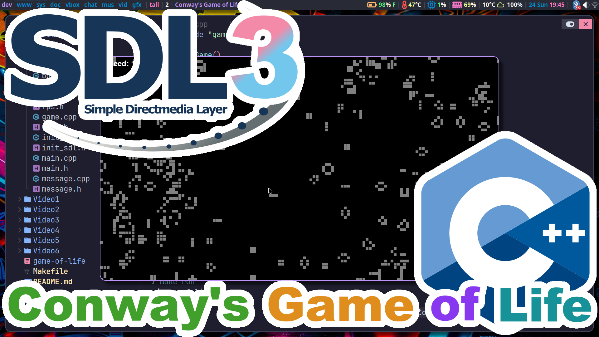

# Conway's Game of Life (C++ - SDL3)
Conway's Game of Life is a classic cellular automaton devised by British mathematician John Horton Conway in 1970. It's a zero-player game, meaning its evolution is determined by its initial state, with no further input from humans. Despite its simplicity, the Game of Life exhibits complex and fascinating patterns.

* If a dead cell has exactly three live neighbors, it becomes alive in the next generation.
* If a live cell has two or three live neighbors, it remains alive in the next generation.
* In all other cases, a cell dies or remains dead.

# ArchLinux instructions.
You will need to make sure SDL3, SDL3_image, and SDL3_ttf is installed.
```
sudo pacman -S --needed base-devel sdl3
```
```
cd
git clone https://aur.archlinux.org/sdl3_image-git.git
sdl3_image-git
makepkg -i
```
```
cd
git clone https://aur.archlinux.org/sdl3_ttf-git.git
sdl3_ttf-git
makepkg -i
```
```
cd
git clone https://github.com/ProgrammingRainbow/Conways-Game-of-Life-C-SDL3
cd Conways-Game-of-Life-C-SDL3
make run
```
The Makefile supports these commands:
```
make rebuild
make clean
make release
make debug
SRC_DIR=Video6 make rebuild run
```
# Controls
Up Arrow - Speeds up the game.\
Down Arrow - Slows down the game.\
Space Bar - Toggles game pauses.\
Escape - Quits the game.\
R - Resets and randomizes the board.\
C - Clears the board.\
F - Toggles display FPS.\
Mouse Click - Toggles a cell on/off.
